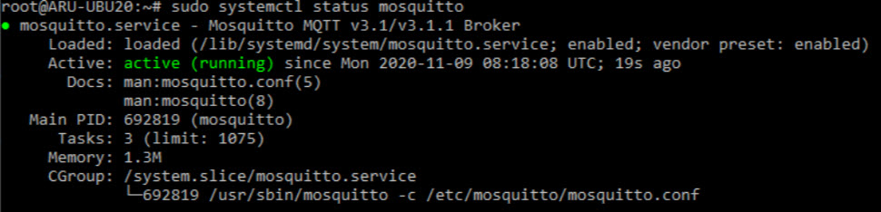
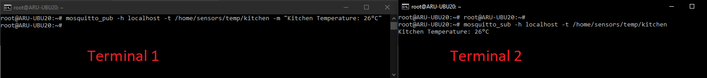
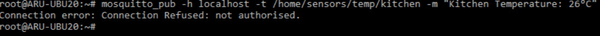

# MQTT-Server-Installation
Introduction
    Mosquitto is open-source message broker that uses  Message Queuing Telemetry Transport (MQTT) Protocol. MQTT runs over TCP/IP and Standard messaging platform for  Internet of Things (IoT). MQQT protocol is  lightweight Protocal , Used minimal resources such as short battery life,Mosquitto application supports  "Publisher/Subscriber Topology". 
Prerequisites
To follow along with this guide, you need:
•	An Ubuntu 20.04 server.
•	A non-root user with sudo rights.

# 1. Install the Mosquitto Server
You'll pull the mosquitto package from Ubuntu's software repository by executing the following steps.

1.	SSH to your server and update the package information index.

          $ sudo apt update 

2.	Install the mosquitto package.

         $ sudo apt install -y mosquitto

3.	The mosquitto package should now load on your server. Confirm the status of the mosquitto service.

Ensure the package is loaded and active.

 ● mosquitto.service - Mosquitto MQTT v3.1/v3.1.1 Broker
      Loaded: loaded (/lib/systemd/system/mosquitto.service; enabled; vendor pr>
      Active: active (running) since Fri 2021-10-08 06:29:25 UTC; 12s ago
        Docs: man:mosquitto.conf(5)
              man:mosquitto(8)

 ...
4.	Once running, you can manage the mosquitto services by executing the following commands.
o	Stop the mosquitto service:

        $ sudo systemctl stop mosquitto

o	Start the mosquitto service:

        $ sudo systemctl start mosquitto

o	Restart the mosquitto service:

        $ sudo systemctl restart mosquitto
        
o	Restart the mosquitto service:

        $ sudo systemctl status mosquitto

        
# 2. Install and Test the Mosquitto Clients
When using an MQTT client, you connect to the Mosquitto broker to send and receive messages on different topics depending on the application's use case. A client can either be a publisher, a subscriber, or both.
1.	The Mosquitto package ships with a command-line client that allows you to test the server functionalities. Install the client.

         $ sudo apt install -y mosquitto-clients

Terminal 1:

         $ mosquitto_pub -h localhost -t /home/sensors/temp/kitchen -m "Kitchen Temperature: 26°C"

Terminal 2:

         $ mosquitto_sub -h localhost -t /home/sensors/temp/kitchen 

# 3. Secure the Mosquitto Server
By default, the Mosquitto server is not secured. However, you can make some configuration settings to secure it with usernames and passwords.
1.	Mosquitto reads configuration information from the following location.
          /etc/mosquitto/conf.d
2.	Create a default.conf under the directory.
          $ sudo nano /etc/mosquitto/conf.d/default.conf
3.	Paste the information below to disable anonymous connections and allow Mosquitto to read valid credentials from the /etc/mosquitto/passwd file.
4.	 allow_anonymous false
          password_file /etc/mosquitto/passwd

5.	Save and close the file.
6.	Open the /etc/mosquitto/passwd file with nano.

        $ sudo nano /etc/mosquitto/passwd

7.	Then, populate the file with the account details for the users that you want to connect to the Mosquitto server. Replace EXAMPLE_PASSWORD and EXAMPLE_PASSWORD_2 with strong values.
8.	       john_doe:EXAMPLE_PASSWORD
           mary_smith:EXAMPLE_PASSWORD_2

9.	Save and close the file.
10.	Next, use the mosquitto_passwd utility to encrypt the passwords.

        $ sudo mosquitto_passwd -U /etc/mosquitto/passwd

11.	Your passwords are now encrypted in a format that only the Mosquitto server can decrypt. Use the Linux cat command to confirm the encryption process.

        $ sudo cat /etc/mosquitto/passwd

Output.

       john_doe:$6$TSzNycsj...5Qyvgd4g==
        mary_smith:$6$DtlKf1lG.../rLHIL0Q==

12.	Restart the mosquitto service to load the new changes.

       $ sudo systemctl restart mosquitto

To republish the same message on Terminal 1 an error message will be shown as you are not authenticated to the network.

From this moment, the login data, both for the publication and for the subscription to the topics have to be specified.

To do so, use the following syntax:

Publication: # mosquitto_pub -h address -t topic -m "message" -u "username" -P "password"

Subscription:# mosquitto_sub -h address-t topic-u "usurname" -P "password"
