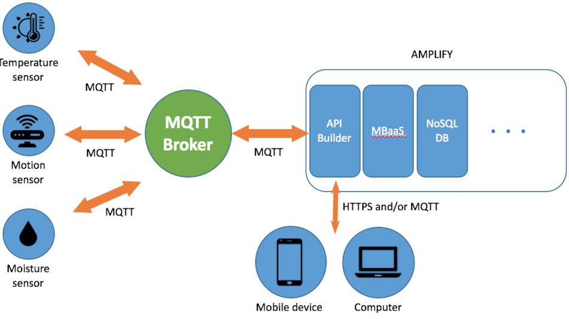

# MQTT-Server-Installation
Introduction
Mosquitto is an open-source message broker that uses the Message Queuing Telemetry Transport (MQTT) Protocol. MQTT runs on top of the TCP/IP model and is the standard messaging platform for the Internet of Things (IoT).
Since the MQQT protocol is extremely lightweight, its small code footprint allows you to create applications for devices with minimal resources such as short battery life, limited network bandwidth, and unreliable internet connections.
The Mosquitto application supports the publisher/subscriber topology. In this model, clients connect to the Mosquitto server, which acts as a broker to distribute information to other clients subscribed or sending messages to a channel.
In this guide, you'll install and configure the Mosquitto application and learn how the event-driven MQQT protocol works with IoT applications.
Prerequisites
To follow along with this guide, you need:
•	An Ubuntu 20.04 server.
•	A non-root user with sudo rights.

1. Install the Mosquitto Server
You'll pull the mosquitto package from Ubuntu's software repository by executing the following steps.
1.	SSH to your server and update the package information index.
 $ sudo apt update 
2.	Install the mosquitto package.
 $ sudo apt install -y mosquitto
3.	The mosquitto package should now load on your server. Confirm the status of the mosquitto service.
 $ sudo systemctl status mosquitto
Ensure the package is loaded and active.
 ● mosquitto.service - Mosquitto MQTT v3.1/v3.1.1 Broker
      Loaded: loaded (/lib/systemd/system/mosquitto.service; enabled; vendor pr>
      Active: active (running) since Fri 2021-10-08 06:29:25 UTC; 12s ago
        Docs: man:mosquitto.conf(5)
              man:mosquitto(8)

 ...
4.	Once running, you can manage the mosquitto services by executing the following commands.
o	Stop the mosquitto service:
  $ sudo systemctl stop mosquitto
o	Start the mosquitto service:
  $ sudo systemctl start mosquitto
o	Restart the mosquitto service:
  $ sudo systemctl restart mosquitto
2. Install and Test the Mosquitto Clients
When using an MQTT client, you connect to the Mosquitto broker to send and receive messages on different topics depending on the application's use case. A client can either be a publisher, a subscriber, or both.
1.	The Mosquitto package ships with a command-line client that allows you to test the server functionalities. Install the client.
 $ sudo apt install -y mosquitto-clients
2.	Next, you'll subscribe to a topic. In the MQQT protocol, a topic is a string that the server/broker uses to filter messages for the connected clients. For instance, here are some sample topics that you can use when using the Mosquitto broker in a home automation application.
o	home/lights/sitting_room
o	home/lights/kitchen
o	home/lights/master_bedroom
o	home/lights/kids_bedroom
3.	To subscribe to a topic, execute the mosquitto_sub -t command followed by the name of the topic that you want to subscribe to. For example, to subscribe to the home/lights/sitting_room topic, execute.
 $ mosquitto_sub -t "home/lights/sitting_room"
Please note that the above command has a blocking function and will put your shell terminal in a listening state.
4.	Open a second terminal window and don't close the first one. This time around, publish an "ON" message to the topic home/lights/sitting_room topic using the mosquitto_pub -m command.
 $ mosquitto_pub -m "ON" -t "home/lights/sitting_room"
5.	You should now receive the ON payload in the first window.
 ON
6.	Next, publish an OFF message still on the same home/lights/sitting_room topic on your second terminal.
 $ mosquitto_pub -m "OFF" -t "home/lights/sitting_room"
7.	Your broker should display the new message as well.
8.	 ON
 OFF
9.	In this guide, you're manually subscribing and publishing messages using the Mosquitto Clients for demonstration purposes. In real-life applications, you should program small microchip devices that support the TCP/IP layer like the ESP8266 to push a message to a broker to control or even monitor devices. Here are some common use-cases where the Mosquitto package is used in real life.
o	Monitoring patients' heartbeats and sending them to a central server for monitoring by doctors. This avoids heavy transport costs that the patients could incur by traveling to the hospital.
o	In the gas and the oil industry, MQQT devices monitor different parameters and send the data to a central broker. Usually, this involves thousands of sensors in remote locations that collect and send data through satellite links that are billed per data usage. Luckily, the MQQT topology keeps the transmission minimal and only pushes data to the server when necessary.
o	In the transport industry, MQQT devices monitor the location of trains in real-time and send data to the companies' headquarters in order to provide better insights to customers who want to travel without any delays.
o	Also, the Mosquitto broker can be used as a middle layer in a chat application to refresh the online status of users and pass messages between end-users.
o	Another common scenario where the Mosquitto server can be a good fit is in decoupled systems. Clients can send data to the broker, which then sends the data to a database for permanent storage.
10.	In addition to the above use-cases, there are dozens of libraries that you can use to connect to the Mosquitto server using your favorite programming language, including PHP, Python, Golang, and more.
3. Secure the Mosquitto Server
By default, the Mosquitto server is not secured. However, you can make some configuration settings to secure it with usernames and passwords.
1.	Mosquitto reads configuration information from the following location.
 /etc/mosquitto/conf.d
2.	Create a default.conf under the directory.
 $ sudo nano /etc/mosquitto/conf.d/default.conf
3.	Paste the information below to disable anonymous connections and allow Mosquitto to read valid credentials from the /etc/mosquitto/passwd file.
4.	 allow_anonymous false
 password_file /etc/mosquitto/passwd
5.	Save and close the file.
6.	Open the /etc/mosquitto/passwd file with nano.
 $ sudo nano /etc/mosquitto/passwd
7.	Then, populate the file with the account details for the users that you want to connect to the Mosquitto server. Replace EXAMPLE_PASSWORD and EXAMPLE_PASSWORD_2 with strong values.
8.	 john_doe:EXAMPLE_PASSWORD
 mary_smith:EXAMPLE_PASSWORD_2
9.	Save and close the file.
10.	Next, use the mosquitto_passwd utility to encrypt the passwords.
 $ sudo mosquitto_passwd -U /etc/mosquitto/passwd
11.	Your passwords are now encrypted in a format that only the Mosquitto server can decrypt. Use the Linux cat command to confirm the encryption process.
 $ sudo cat /etc/mosquitto/passwd
Output.
 john_doe:$6$TSzNycsj...5Qyvgd4g==
 mary_smith:$6$DtlKf1lG.../rLHIL0Q==
12.	Restart the mosquitto service to load the new changes.
$ sudo systemctl restart mosquitto
13.	From this point forward, you should execute any pub/sub command using the syntax below. Remember to replace john_doe and EXAMPLE_PASSWORD with the credentials that you defined in the password file.
14.	$ mosquitto_sub -u john_doe -P EXAMPLE_PASSWORD -t "home/lights/sitting_room"
$ mosquitto_pub -u john_doe -P EXAMPLE_PASSWORD -t "home/lights/sitting_room" -m "ON"
Unauthenticated commands or connections with incorrect credentials should now fail.
$ mosquitto_pub -m "ON" -t "home/lights/sitting_room"
$ mosquitto_sub -t "home/lights/sitting_room"
$ mosquitto_sub -u john_doe -P WRONG_PASSWORD -t "home/lights/sitting_room"
$ mosquitto_pub -u john_doe -P WRONG_PASSWORD -t "home/lights/sitting_room" -m "ON"
Output.
...
Connection error: Connection Refused: not authorised.

